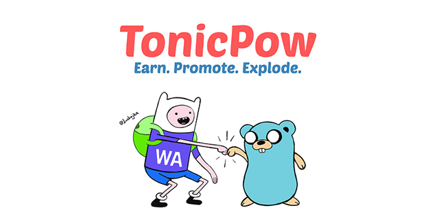

> The official Go implementation for interacting with the [TonicPow API](https://docs.tonicpow.com)

[](https://github.com/tonicpow/go-tonicpow/releases)
[](https://github.com/tonicpow/go-tonicpow/actions)
[](https://goreportcard.com/report/github.com/tonicpow/go-tonicpow)
[](https://codecov.io/gh/tonicpow/go-tonicpow)
[](https://golang.org/)
<br>
[](https://mergify.io)
[](https://join.slack.com/t/tonicpow/shared_invite/zt-mlccqx28-IEabvOGPx_QLyFJJbWE3hQ)

<br/>

## Table of Contents
- [Installation](#installation)
- [Documentation](#documentation)
- [Examples & Tests](#examples--tests)
- [Benchmarks](#benchmarks)
- [Code Standards](#code-standards)
- [Usage](#usage)
- [Maintainers](#maintainers)
- [Contributing](#contributing)
- [License](#license)

<br/>

## Installation

**go-tonicpow** requires a [supported release of Go](https://golang.org/doc/devel/release.html#policy).
```shell script
go get -u github.com/tonicpow/go-tonicpow
```

<br/>

## Documentation
You can view the generated [documentation here](https://pkg.go.dev/github.com/tonicpow/go-tonicpow).

### Features
- [Client](client.go) is completely configurable
- Using [heimdall http client](https://github.com/gojek/heimdall) with exponential backoff & more
- Coverage for the [TonicPow.com API](https://docs.tonicpow.com/)
    - [x] [Authentication](https://docs.tonicpow.com/#632ed94a-3afd-4323-af91-bdf307a399d2)
    - [x] [Advertiser Profiles](https://docs.tonicpow.com/#2f9ec542-0f88-4671-b47c-d0ee390af5ea)
    - [x] [Campaigns](https://docs.tonicpow.com/#5aca2fc7-b3c8-445b-aa88-f62a681f8e0c)
    - [x] [Goals](https://docs.tonicpow.com/#316b77ab-4900-4f3d-96a7-e67c00af10ca)
    - [x] [Conversions](https://docs.tonicpow.com/#75c837d5-3336-4d87-a686-d80c6f8938b9)
    - [x] [Rates](https://docs.tonicpow.com/#fb00736e-61b9-4ec9-acaf-e3f9bb046c89)

<details>
<summary><strong><code>Library Deployment</code></strong></summary>
<br/>

[goreleaser](https://github.com/goreleaser/goreleaser) for easy binary or library deployment to Github and can be installed via: `brew install goreleaser`.

The [.goreleaser.yml](.goreleaser.yml) file is used to configure [goreleaser](https://github.com/goreleaser/goreleaser).

Use `make release-snap` to create a snapshot version of the release, and finally `make release` to ship to production.
</details>

<details>
<summary><strong><code>Makefile Commands</code></strong></summary>
<br/>

View all `makefile` commands
```shell script
make help
```

List of all current commands:
```text
all                  Runs multiple commands
clean                Remove previous builds and any test cache data
clean-mods           Remove all the Go mod cache
coverage             Shows the test coverage
generate             Runs the go generate command in the base of the repo
godocs               Sync the latest tag with GoDocs
help                 Show this help message
install              Install the application
install-go           Install the application (Using Native Go)
lint                 Run the golangci-lint application (install if not found)
release              Full production release (creates release in Github)
release              Runs common.release then runs godocs
release-snap         Test the full release (build binaries)
release-test         Full production test release (everything except deploy)
replace-version      Replaces the version in HTML/JS (pre-deploy)
run-examples         Runs all the examples
tag                  Generate a new tag and push (tag version=0.0.0)
tag-remove           Remove a tag if found (tag-remove version=0.0.0)
tag-update           Update an existing tag to current commit (tag-update version=0.0.0)
test                 Runs vet, lint and ALL tests
test-ci              Runs all tests via CI (exports coverage)
test-ci-no-race      Runs all tests via CI (no race) (exports coverage)
test-ci-short        Runs unit tests via CI (exports coverage)
test-short           Runs vet, lint and tests (excludes integration tests)
test-unit            Runs tests and outputs coverage
uninstall            Uninstall the application (and remove files)
update-linter        Update the golangci-lint package (macOS only)
vet                  Run the Go vet application
```
</details>

<br/>

## Examples & Tests
All unit tests and [examples](examples) run via [Github Actions](https://github.com/tonicpow/go-tonicpow/actions) and
uses [Go version 1.15.x](https://golang.org/doc/go1.15). View the [configuration file](.github/workflows/run-tests.yml).

#### View all [real working examples](examples).
- [Loading the Library](examples/new_client)
- [Advertiser Profile Examples](examples/advertiser_profiles)
- [Campaign Examples](examples/campaigns)
- [Goal Examples](examples/goals)
- [Conversion Examples](examples/conversions)
- [Rates Example](examples/rates)

Run all tests (including integration tests)
```shell script
make test
```

Run tests (excluding integration tests)
```shell script
make test-short
```

<br/>

## Benchmarks
Run the Go [benchmarks](tonicpow_test.go):
```shell script
make bench
```

<br/>

## Code Standards
Read more about this Go project's [code standards](CODE_STANDARDS.md).

<br/>

## Usage
Checkout all the [real working examples](examples).
- [Loading the Library](examples/new_client)
- [Advertiser Profile Examples](examples/advertiser_profiles)
- [Campaign Examples](examples/campaigns)
- [Goal Examples](examples/goals)
- [Conversion Examples](examples/conversions)
- [Rates Example](examples/rates)

<br/>

## Maintainers
| [](https://github.com/mrz1836) | [](https://github.com/rohenaz) |
|:---:|:---:|
| [MrZ](https://github.com/mrz1836) | [Satchmo](https://github.com/rohenaz) |

<br/>

## Contributing
If you're looking for a library using JavaScript, checkout [tonicpow-js](https://github.com/tonicpow/tonicpow-js)

View the [contributing guidelines](CONTRIBUTING.md) and follow the [code of conduct](CODE_OF_CONDUCT.md).

Support the development of this project 🙏

[](https://tonicpow.com/?af=go-tonicpow) [](https://twitter.com/intent/tweet?text=TonicPow%20integration%20with%20Go%20rocks!%20Check%20it%20out:%20https%3A%2F%2Ftncpw.co%2F7ca46e94) [](https://twetch.app/compose?description=TonicPow%20integration%20with%20Go%20rocks!%20Check%20it%20out:%20https%3A%2F%2Ftncpw.co%2F7ca46e94)

[](https://github.com/tonicpow/go-tonicpow/stargazers)

<br/>

## License

[](/LICENSE)
